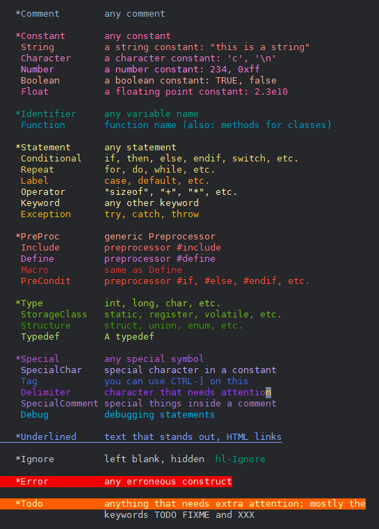

Config Repository
=================

This repository collects misc `rc` or `ini` (or similar) files.

Vimrc
-----
The `_vimrc` is mostly for Windows OSes. It is used only with GVim.

Vim color scheme
----------------

The `_desert.vim` is a Vim color scheme based on *desert.vim* by Hans Fugal.

It is a dark color scheme for newer GUI Vim 8.0.x versions, and somewhat
resembles standard dark color schemes provided with Vim.

The image below captures common elements taken from `:help syntax`.

> **Caution**: `_desert.vim` include the highlight color for `QuickFixLine`,
> and therefore needs newer Vim 8.0 GUI builds.

### Installation

Just download and copy the `_desert.vim` to `~/.vim/colors/` on *Unixes* or
to `$HOME\vimfiles\colors` on Windows.

### Trivia

An underscore is added to the original name of the color scheme to make it
distinct and also to make it the first one in menu.

It was triggered by the quest to find *perceptually equidistant colors* or 
*perceptually-distinct colors*. However, the currently used colors do not
necessarily fit either criteria though!

The colors are mostly influenced by the C/C++ syntax highlighting, and
therefore it is deliberate that the `Comment` is somewhat darker and `Macro`
is even more darker, and so on...

