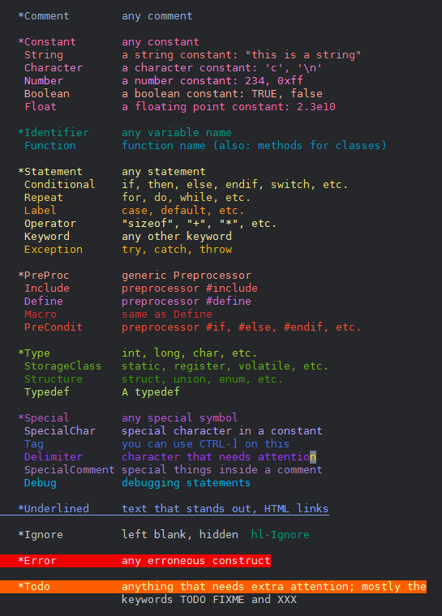

Config Repository
=================

This repository collects miscellaneous *rc* or *ini* (or similar) files.

Vim
---
The vim directory has a *_vimrc*, a color-scheme and few other files.

It is safe to use the color scheme.

> **Caution:** The vimrc and the other files can be problematic as they may
> conflict with other plugins or may have conflicting key mappings.
> 
> *These files can be buggy! Read and evaluate them before using them.*

### Vimrc

The *_vimrc* is mostly for Windows OSes. It is used only with GVim.

### Vim color scheme

The directory *vim/colors* has a color-scheme named *rested.vim*.
The *rested.vim* is based on *desert.vim* by Hans Fugal.

It is a dark color scheme for newer GUI Vim 8.0.x versions, and more or less
resembles standard dark color schemes provided with Vim.

The image below captures common elements taken from *:help syntax*.

#### Notes

It was triggered by the quest to find *perceptually equidistant colors* or 
*perceptually-distinct colors*. However, the currently used colors do not
necessarily fit either criteria though!

The colors are mostly influenced by the C/C++ syntax highlighting, and
therefore it is deliberate that the *Comment* is somewhat darker and *Macro*
is even more darker, and so on...

### Status-line Plugin

The *dstatus.vim* found inside *vim/plugin* provides a minimal yet slightly
informative dynamic status-line. It provides informative status-line when a
file is read or written, and after few seconds reverts to minimal info.

### Installation

To install color-scheme, download and copy the `rested.vim` to your
`~/.vim/colors/` on *Unixes* or to `$HOME\vimfiles\colors` on Windows.

To install all files, download and copy the files found inside the `vim`
directory to `$HOME\vimfiles` on Windows.

